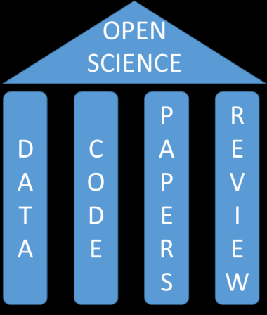
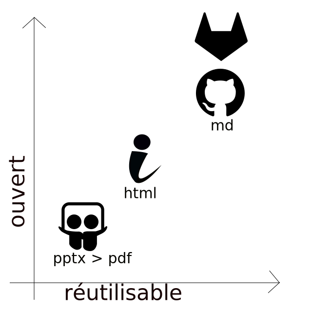
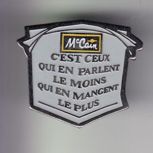

<!-- $theme: default-->
<!-- $size: 16:9 -->

# Contribuer à la science ouverte : dire et faire

## oawlyon2018 : Bibliothèques et chercheurs : la science ouverte en commun

18 octobre 2018

Le matériel de cette présentation est disponible en ligne [ici](https://github.com/fflamerie/oawlyon2018)

<small>
  
*Frédérique Flamerie*
  
*chargée de mission science ouverte/données de recherche*

*Université de Bordeaux - Direction de la documentation*

</small>

---

# Contribuer à la science ouverte : dire et faire

## oawlyon2018 : Bibliothèques et chercheurs <mark>et ingénieurs, personnels administratifs, etc.</mark> : la science ouverte en commun

18 octobre 2018

<small>
  
*Frédérique Flamerie*

*chargée de mission science ouverte/données de recherche*

*Université de Bordeaux - Direction de la documentation*

</small>

---

# Sous-titre (1/4)

Je vais vous parler de :

* ~~faux pas~~,
* pas de deux,
* pas de côté,
* petits pas,
* démarche,

alors j'avais pensé à "En marche". Et puis je me suis souvenue que cette expression était devenue un slogan politique, et qu'elle risquait de m'entraîner dans une direction que je ne souhaitais pas forcément suivre.

---
# Sous-titre (2/4)

Aussi ai-je choisi un autre titre, qui me permettra de partager avec vous des variations autour des thèmes suivants.

* Quand dire c'est faire
* Faire ce que l'on dit
* Dire ce que l'on fait [où dire signifie davantage documenter que communiquer]
* Accomoder les grands discours et les petites actions, la grande image de "La Science Ouverte" et la petite image de ses routines de travail

---
# Sous-titre (3/4)

Le tout appliqué à la science ouverte.

<small>

Source figure : Masuzzo, P. & Martens, L. (2017). Do you speak open science? Resources and tips to learn the language. _PeerJ Preprints_, _5_, e2689v1. https://doi.org/10.7287/peerj.preprints.2689v1

</small>

---

# Sous-titre (4/4)

On peut ajouter 2 autres piliers :
* _methodology_
* _education_

<small>

Voir : Watson, M. (2015). When will ‘open science’ become simply ‘science’? _Genome Biology_, _16_, 101. https://doi.org/10.1186/s13059-015-0669-2

</small>

Ou avoir une vision encore plus large si on considère l'_open scholarship_

> I will use the even broader term "open scholarship" to encompass sharing of research and nonresearch products, such as those arising from educational and outreach activities.

<small>

McKiernan, E. C. (2017). Imagining the “open” university: Sharing scholarship to improve research and education. _PLOS Biology_, _15_(10), e1002614. https://doi.org/10.1371/journal.pbio.1002614

</small>

---

# Programme
## Pilier "publications" :running:
## Pilier "enseignement" :running:
## Pilier "données" :walking: 

---

# Le pilier "publications" : quand dire c'est faire

---

# Lecture

Zhang, H., Boock, M., & Wirth, A. A. (2015). It Takes More Than a Mandate: Factors That Contribute To Increased Rates of Article Deposit to an Institutional Repository. _Journal of Librarianship and Scholarly Communication_, _3_(1). https://doi.org/10.7710/2162-3309.1208

---

# Le service des "messages HAL" à l'UPMC - principe 

_Service adapté de Rennes 1._
_Il a fait l'objet d'un atelier lors de la journée casuHAL 2017 - voir [le support en ligne](https://iww.inria.fr/casuhal/journee-casuhal-2017-atelier-message-hal/)._

Il s'agit d'effectuer une veille sur les plateformes d'éditeur et les bases de données bibliographiques pour envoyer à chaque chercheur de l'UPMC un message dès la parution d'un article dont il est auteur. Dans ce message :
* on lui indique les autorisations de dépôt dans HAL pour cet article en particulier,
* on lui propose d'effectuer ce dépôt pour lui, à sa place.

Si au passage on repère des articles sous licence _Creative Commons_, on les dépose sans rien demander à personne.

Le service inclut un service de relance, _i. e._ un 2nd message est envoyé 15 jours après le 1er en cas de non réponse.

---

# Le service des "messages HAL" à l'UPMC - éléments de volumétrie

L'UPMC en 2 chiffres :  
* plus de 100 laboratoires, 
* plus de 150 nouveaux articles chaque semaine dans le Web of Science.

 

_Chiffres préparés en juin 2017_

Pour une période de 6 mois :

* 1600 messages envoyés, y compris les messages de relance,
* 600 articles déposés en texte intégral.

---

# Le service des "messages HAL" à l'UPMC - bénéfices

## Bénéfices directs
Ce service permet de sensibiliser de façon personnalisée et contextuelle (= dire) des chercheurs que l'on ne voit jamais, tout en contribuant concrètement à l'augmentation du nombre de dépôts en texte intégral (= faire).

## Bénéfices induits, ou du moins perçus - liste non exhaustive
Ce service permet d'effectuer soi-même davantage de dépôts, de manipuler davantage de manuscrits (de tous formats), de se confronter soi-même à certaines des difficultés que peuvent rencontrer les auteurs, de mieux connaître les publications de son institution, de se constituer très facilement un ensemble d'exemples, de cas pratiques, etc. pour les formations et autres formes de sensibilisation où on dit sans faire.

---

# Le service des "messages HAL" à l'UPMC - outillage et périmètre 1/2

| v1 | v2 |
| :---- | :---- |
| agrégateur RSS + messagerie + Zotero + ZotFile |  agrégateur RSS + messagerie + Zotero + ZotFile + [OverHAL](https://halur1.univ-rennes1.fr/OverHAL.php)|
| plateformes éditeur |  plateformes éditeur + Web of Science + Pubmed |
| auteurs  correspondants + auteurs y compris non correspondants pour certains laboratoires | _idem_|

Le point clé : on peut commencer modestement!

---

# Le service des "messages HAL" à l'UPMC - outillage et périmètre 2/2

_Pourquoi utiliser de multiples plateformes d'éditeur plutôt que seulement 1 ou 2 bases de données bibliographiques?_

Créer des alertes (RSS et/ou courriel) sur les plateformes d'éditeur a 2 atouts :
* être informé en temps réel de la publication de l'article (et pouvoir contacter le chercheur le plus tôt possible, avant qu'il n'ait supprimé son manuscrit auteur de ses fichiers...),
* pouvoir récupérer le manuscrit accepté lorsque l'éditeur le met en ligne (Elsevier, ACS ou  Wiley, dans les 3 cas pour certaines revues seulement). 

On essaie aussi de trouver une version de manuscrit accepté sur ResearchGate, le site personnel d'un auteur, etc. Ces recherches complémentaires sont effectuées très rapidement avec OverHAL ou simplement Zotero.

Lorsque l'on a pu récupérer un fichier déposable, on sollicite seulement de la part de l'auteur l'autorisation de dépôt, mais **on ne dépose pas sans son accord**.

---

# Le service des "messages H2020" à l'université de Bordeaux - principe

_Service adapté d'Aix-Marseille Université._

Ce service est articulé à d'autres actions menées avec le service de montage et d'accompagnement des projets de l'université de Bordeaux, comme la **participation aux réunions de lancement des projets H2020**, pour présenter les aspects _open access_ et être identifiée comme interlocutrice sur ces questions.

Il s'agit d'effectuer une veille sur OpenAIRE et une base de données bibliographique pour proposer un appui individualisé et contextualisé à chaque chercheur pour les articles liés à un projet H2020 pour lequel il assure une responsabilité, _i. e._
* tout article lié au projet si l'université de Bordeaux est coordinateur du projet,
* article pour lequel l'auteur est correspondant pour les projets en partenariat.

---
# Le service des "messages H2020" à l'université de Bordeaux - bénéfices et outillage

Les bénéfices sont analogues à ceux du service des "messages HAL".
L'outillage est plus léger :
* toujours Zotero et Zotfile,
* toujours une messagerie pour recevoir les alertes,
* Scopus a remplacé le Web of Science.

On propose le dépôt dans HAL, Zenodo ou une autre archive au choix de l'auteur. On pourra bientôt proposer l'archive ouverte institutionnelle.

---

# Le pilier "enseignement"
## Faire ce que l'on dit et dire ce que l'on fait - _do what you preach_
## Un domaine d'application : les formations BU

---

# Lecture

J'ai lu cet article il y a trop peu de temps, sinon j'aurais sûrement marché différemment avant.

> For tools like EndNote, Mendeley, and Zotero that have tutorials available on their websites, perhaps a better use of librarians’ time in supporting researchers would be to help answer questions on the online forums rather than to create their own versions of bibliographic manager tutorials. Alternatively, librarians might consider building easily searchable and findable FAQs for the tools that do not have these resources to support users with specific bibliographic manager questions.

Rempel, H. G. & Mellinger, M. (2015). Bibliographic Management Tool Adoption and Use A Qualitative Research Study Using the UTAUT Model. _Reference & User Services Quarterly_, _54_(4), 43‑53. https://doi.org/10.5860/rusq.54n4.43

---

# La démarche

Une série de petits pas pour un grand bond en avant. Vous l'avez compris, l'exemple est celui des formations à Zotero.

.pptx convertis en .pdf sur Slideshare > .html sur LibGuides > .md sur GitHub > wiki Zotero + ma bibliothèque Zotero, son paramétrage, ses contenus, etc. (=mon expérience utilisateur réelle)

---

# La démarche

---

# Une démarche à suivre ?

Les citations sont longues, rassurez-vous je ne vais pas les lire.

>The University of Oklahoma Libraries announces the release of an open-source Markdown Converter designed to help make open content, including open educational resources (OER), shareable to the fullest extent possible. By using the Markdown Converter, well-structured documents can be converted into PDF, HTML, EPUB, and DOCX file formats with an easy-to-use web interface instead of the command line.

 
<small>

University of Oklahoma Libraries. (2017). University of Oklahoma Libraries announces release of open source, Markdown Converter to make open content more widely shareable. _University of Oklahoma Libraries_. Repéré à https://libraries.ou.edu/content/news-markdown-converter

</small>

---

# Une démarche à suivre ?

Les citations sont longues, rassurez-vous je ne vais pas les lire.

>Cable Green, director of open education for Creative Commons (CC) says, “the open education community has created and openly licensed content that can be reused, modified and redistributed by anyone for 15 years, but we’re not always thoughtful about sharing in open, editable file formats. When we share OER as PDF, for example, downstream users can’t easily edit the document. Using Markdown and the Markdown Converter helps open educators get their openly-licensed content into a common, standard, editable format so it can be easily revised and remixed by them and others. I look forward to watching and learning how OER creators and remixers use the Markdown Converter.”

 
<small>

University of Oklahoma Libraries. (2017). University of Oklahoma Libraries announces release of open source, Markdown Converter to make open content more widely shareable. _University of Oklahoma Libraries_. Repéré à https://libraries.ou.edu/content/news-markdown-converter

</small>

---

# Un dernier exemple : le matériel d'une journée d'étude

Le matériel est déposé dans Zenodo et documenté. Les compte-rendus des ateliers sont disponibles en version PDF et Markdown.

 

Barale, M., Bordignon, F., Ciolek-Figiel, A., François, C., Moysan, M., Reymonet, N., & Roche, I. (2018, 17 mai). Des outils pratiques pour gérer et valoriser vos données de recherche. Bordeaux. https://doi.org/10.5281/zenodo.1256735

 

<small>

_Journée co-organisée par les universités de Bordeaux et Bordeaux Montaigne et l'Urfist de Bordeaux._

</small>

---

# Le pilier "données"
## Faire ce que l'on dit, dire ce que l'on fait
## Accomoder les grands discours et les petites actions

---

# Rien n'est simple, tout se complique - liste non exhaustive

Les données sont variables, diverses, hétérogènes, etc. : (presque) tout matériel peut être "donnée de recherche" dans un contexte donné.

On ne peut pas seulement bricoler _a posteriori_ des fichiers PDF, Word, etc.

On peut effectuer moins d'actions pour (= à la place de) les chercheurs.

Le repérage des données des chercheurs de son institution n'est pas facile.

Il faut vraiment penser aux machines, _i. e._ s'assurer que les données ne soient pas seulement _human readable_ mais aussi _machine readable_.

---

# Lectures

>_As a researcher concerned to develop better RDM practice, I need support to meet me where I am, so ultimately I can support you in making the case that it matters._

<small>

Neylon, C. (2017, 16 juin). As a researcher…I’m a bit bloody fed up with Data Management. _Science in the Open_. Repéré à http://cameronneylon.net/blog/as-a-researcher-im-a-bit-bloody-fed-up-with-data-management/

</small>

et
> In fact, until recently I was an open-data hypocrite. Although I was committed to open data, I was not implementing it in practice. I made my commitments boldly in data-management plans for grant-funding agencies.

<small>

Rouder, J. N. (2016). The what, why, and how of born-open data. _Behavior Research Methods_, _48_(3), 1062‑1069. https://doi.org/10.3758/s13428-015-0630-z

</small>

---

# Changer de culture, changer d'habitudes
 

> Our philosophy is that the key change is cultural not technological.

 

<small>

Dunning, A. (2018, 6 octobre). Changing Cultures of Research Data Management. Communication présentée au Danish eInfrastructure Conference, Federica. https://doi.org/10.6084/m9.figshare.7176512.v1

</small>

 

Si le changement culturel (le non-technologique) englobe des enjeux aussi larges que la question de la reproducibilité ou celle de l'évaluation, il implique aussi de modifier ses méthodes et habitudes de travail quotidiennes.

---

# Que faire pour essayer d'y contribuer et comment dire ? Exemple 1 : enquête

Nous souhaitons organiser une enquête concernant la gestion des données de recherche auprès de la communauté scientifique de l'université.

Nous souhaitons en profiter pour contribuer, faire ce que nous disons et dire en faisant.

---

# Que faire pour essayer d'y contribuer et comment dire ? Exemple 1 : enquête

Plutôt que de créer notre propre enquête maison, nous allons utiliser un outil existant, l'enquête [Quantitative assessment of research data management practice](https://osf.io/mz3fx/wiki/home/) conçue par les bibliothèques de l'EPFL, des universités de Delft, Cambridge et d'Illinois.

Il s'agira de :
* sensibiliser les chercheurs aux questions liées aux données de recherche,
* en montrant que ce sont des questionnements partagés,
* en recueillant des informations sur les pratiques et attentes de notre communauté,
* en contribuant à alimenter un jeu de données concernant les pratiques de RDM,
* en manifestant l'existence de la mission "données de recherche" au sein de la Direction de la documentation.

---

# Que faire pour essayer d'y contribuer et comment dire ? Exemple 2 : des formations

Les formations que nous avons organisées ont un versant pratique très marqué. L'un des objectifs est d'accomoder la grande image et la petite image, en partant de cette dernière.

J'ai déjà évoqué la journée du 17 mai, en la nommant de façon impropre "journée d'étude", car les ateliers pratiques constituaient l'essentiel du programme.

L'Urfist de Bordeaux a intégré à sa programmation une formation [Organiser efficacement ses données](https://github.com/fflamerie/organisation_donnees_2018).

---

# 1 pas de côté pour conclure

## Contribution à des revues systématiques
En ce qui me concerne pour le domaine des sciences de l'environnement ; d'autres domaines que la médecine peuvent être concernés.

### Lecture

Riegelman, A. & Kocher, M. (2018). For Your Enrichment: A Model for Developing and Implementing a Systematic Review Service for Disciplines outside of the Health Sciences. _Reference & User Services Quarterly_, _58_(1), 22‑27. https://doi.org/10.5860/rusq.58.1.6837

---

# Et un dernier slogan, publicitaire cette fois-ci

---
# Merci de votre attention
 

## frederique.flamerie-de-lachapelle@u-bordeaux.fr
 

[orcid.org/0000-0001-6014-0134](https://orcid.org/0000-0001-6014-0134)

 

_Note technique : présentation composée en Markdown avec le logiciel Marp_

<!--footer : crédits : icône Slideshare par Pixel Icons, icônes GitHub et GitLab par Simple Icons -->
